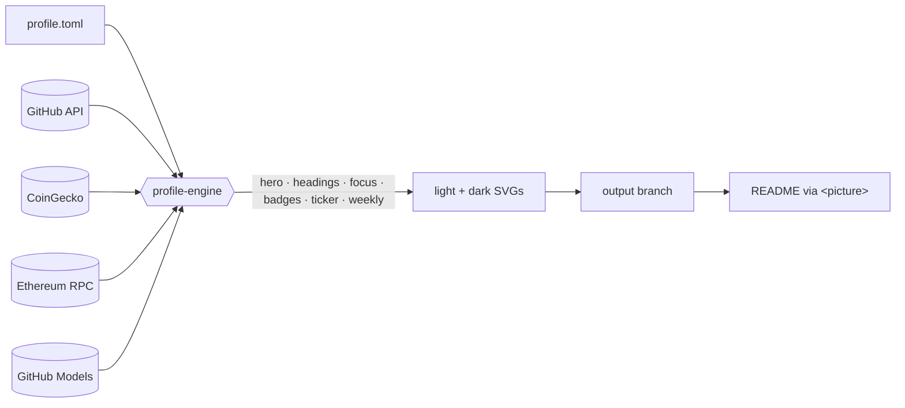

<div align="center">

# NIK Profile Engine

**A self-hosted GitHub Action that renders a living, day/night themed GitHub profile.**
Animated hero · live crypto & Ethereum gas ticker · weekly AI-written summary · zero external image services.

[Live demo → github.com/LucNIK](https://github.com/LucNIK) · [Configuration](#configuration) · [Modules](#modules)

</div>

---

## Why

Most profile READMEs stitch together third-party image services. They rate-limit, go down, and look like everyone
else's. **profile-engine** renders every visual itself, inside your own workflow, from live data — and publishes the
result to a branch of your profile repository. Nothing on your profile depends on someone else's server at view time.

- **Day & night.** Every visual is rendered twice and swapped with `prefers-color-scheme`.
- **Self-contained SVGs.** Fonts are embedded as base64 and icons are hand-drawn paths, so images never load external
  resources — exactly what GitHub's image proxy requires.
- **Live data.** Market prices with 24h sparklines (CoinGecko), Ethereum gas from public JSON-RPC nodes, followers
  from the GitHub API.
- **AI, without secrets.** The weekly summary uses **GitHub Models** with the workflow's own token — no API key to
  manage — and falls back to a deterministic summary if the model is unavailable.
- **Resilient by design.** Each module is isolated: one failing source never breaks the others, and the last good
  snapshot is reused (marked *delayed*) when an API is down.
- **Accessible.** Every SVG has `role="img"` and a descriptive `<title>`; animations respect `prefers-reduced-motion`.
- **Zero dependencies.** Pure Python standard library.

## Architecture



## Usage

```yaml
# .github/workflows/profile.yml
name: Profile
on:
  schedule:
    - cron: "7 * * * *"   # hourly: markets ticker
  workflow_dispatch:

permissions:
  contents: write   # publish the SVGs
  models: read      # weekly AI summary via GitHub Models

jobs:
  render:
    runs-on: ubuntu-latest
    steps:
      - uses: actions/checkout@v4

      - name: Restore previous output (keeps engine state and caches)
        run: |
          mkdir -p dist
          git fetch --depth=1 origin output && git archive FETCH_HEAD | tar -x -C dist || true

      - uses: LucNIK/profile-engine@v1
        with:
          config: profile.toml
          output_dir: dist

      - uses: crazy-max/ghaction-github-pages@v4
        with:
          target_branch: output
          build_dir: dist
          jekyll: false
        env:
          GITHUB_TOKEN: ${{ secrets.GITHUB_TOKEN }}
```

Then reference the images in your README, one `<picture>` per visual:

```html
<picture>
  <source media="(prefers-color-scheme: dark)"  srcset="https://raw.githubusercontent.com/USER/USER/output/ticker-dark.svg">
  <source media="(prefers-color-scheme: light)" srcset="https://raw.githubusercontent.com/USER/USER/output/ticker-light.svg">
  
</picture>
```

### Inputs

| Input | Default | Description |
| --- | --- | --- |
| `config` | `profile.toml` | Path to the configuration file |
| `output_dir` | `dist` | Where SVGs and `engine-state.json` are written |
| `modules` | `all` | Subset: `hero, headings, focus, badges, ticker, weekly` |
| `github_token` | `github.token` | GitHub API + GitHub Models token |
| `python_version` | `3.12` | Python used to run the engine |

## Modules

| Module | Output | Refresh |
| --- | --- | --- |
| `hero` | `hero-{light,dark}.svg` — typewriter title, pure CSS | on every run |
| `headings` | `heading-<slug>-{light,dark}.svg` — numbered section titles | on every run |
| `focus` | `focus-{light,dark}.svg` — icon cards | on every run |
| `badges` | `badge-website-*`, `badge-followers-*` | on every run |
| `ticker` | `ticker-{light,dark}.svg` — prices, 24h change, sparklines, gas | every run (hourly) |
| `weekly` | `weekly-{light,dark}.svg` — AI summary of the last 7 days of commits | once per ISO week |

## Configuration

See [`examples/profile.toml`](examples/profile.toml) for a complete file.

```toml
[profile]
user = "LucNIK"
name = "Luc NIK"
website = "https://ayuefu.com"
timezone = "Asia/Shanghai"

[theme]
font = "IBM Plex Sans"      # any Google Font
light_accent = "#B7860B"    # day
dark_accent = "#C1121F"     # night

[hero]
lines = ["Luc NIK", "Software Engineer", "AI/ML · FinTech · Web3"]

[headings]
titles = ["About", "Focus", "Markets", "This Week"]

[[focus.items]]
title = "AI / ML"
lines = ["Models · data pipelines", "intelligent applications"]
icon = "network"            # network, candles, ethereum, cloud, gas, spark, globe, users, coin

[ticker]
currency = "usd"
gas = true
assets = [{ id = "bitcoin", symbol = "BTC", name = "Bitcoin" }]

[weekly]
model = "openai/gpt-4.1-mini"
exclude_repos = []
```

## Local preview & tests

```bash
python -m profile_engine --config examples/profile.toml --out dist --offline   # sample data, no network
python -m unittest -v
```

## License

[MIT](LICENSE) © John Luke NIKABOU
